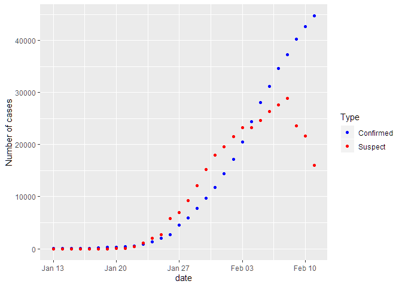
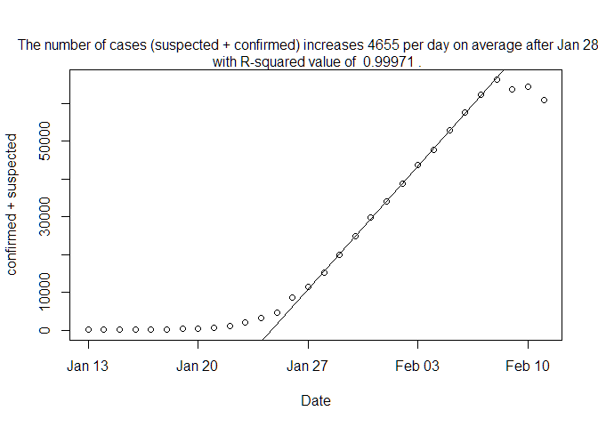
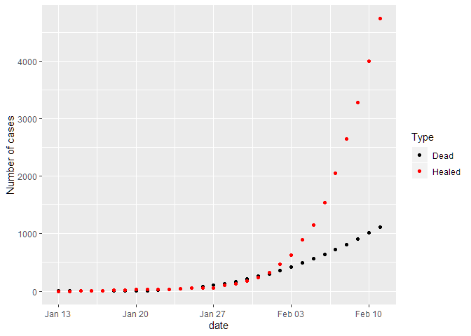
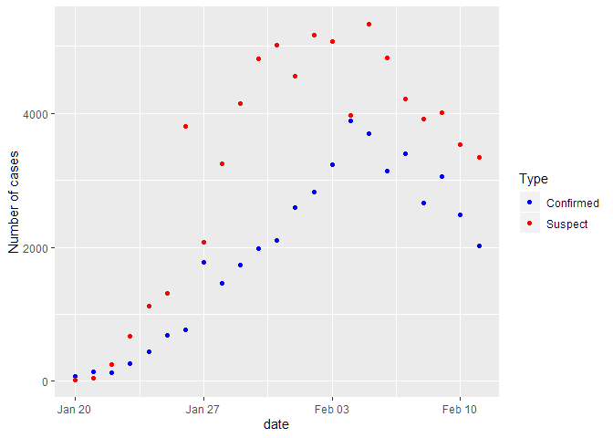
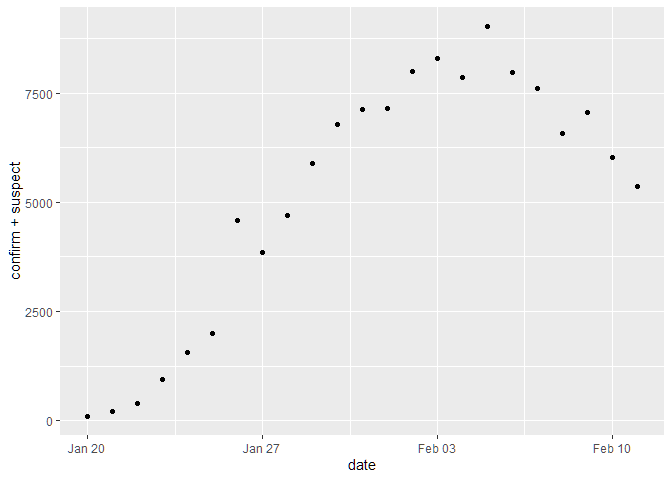
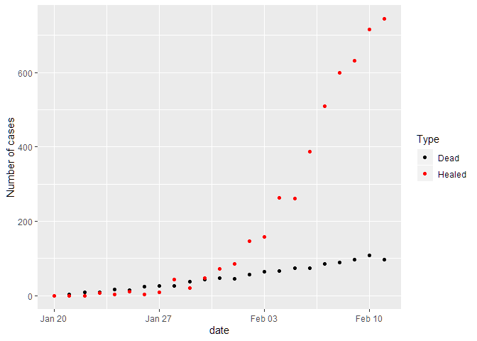

nCoronaVirus\_Report
================
WY
2/4/2020

## Daily Update on the new corona virus statistics

The data was obtained from an R package. To insall that R package. Use
the following command:

``` r
remotes::install_github("GuangchuangYu/nCov2019")
```

Then, I loaded the libraries and data by:

``` r
library(nCov2019)
library(utf8)
library(tidyverse)
library(lubridate)
x <- get_nCov2019()
```

We start from two data sets in the packages: total
confirmed/suspected/dead/recovered numbers of cases and the changes from
the previous day.

We tide up the data with commands below:

``` r
dataDay <- x$chinaDayList %>% mutate(confirm = as.numeric(confirm), suspect = as.numeric(suspect), dead = as.numeric(dead), heal = as.numeric(heal), deathoverconfirm = dead/confirm)
dataDay <- dataDay %>% extract(date,c("month","day"), regex = "^(\\d+)\\.(\\d+)$",remove = FALSE) 
dataDay <- dataDay %>% mutate(month = as.numeric(month), day = as.numeric(day))
dataDay <- dataDay %>% mutate(date = make_date(2020,month,day))

dataAdd <- x$chinaDayAddList %>% mutate(confirm = as.numeric(confirm), suspect = as.numeric(suspect), dead = as.numeric(dead), heal = as.numeric(heal), deathoverconfirm = dead/confirm)
dataAdd <- dataAdd %>% extract(date,c("month","day"), regex = "^(\\d+)\\.(\\d+)$",remove = FALSE) 
dataAdd <- dataAdd %>% mutate(month = as.numeric(month), day = as.numeric(day))
dataAdd <- dataAdd %>% mutate(date = make_date(2020,month,day))
```

The last updated time (Beijing Time)is

``` r
x$lastUpdateTime
```

    ## [1] "2020-02-08 11:31:19"

Now we present the total number of confirmed and suspected respectively.

``` r
dataDay %>% ggplot() + geom_point(aes(date,confirm,colour="Confirmed")) +geom_point(aes(date,suspect,color="Suspect")) +theme(legend.position="right")+ylab("Number of cases")+labs(colour="Type")+scale_color_manual(values=c("blue","red"))
```

<!-- -->

Now we want to put an upper limit on infected cases, so we add up the
confimred and suspected. Because a big portion of suspected cases become
confirmed cases.

It is obvious that starting Jan. 28th, the increase of sum of confirmed
and suspected case is on a straight line.

``` r
dataDay <- dataDay %>% mutate(confandsusp = confirm + suspect)
dataforfitting <- dataDay %>% filter(date > make_date(2020,1,27)) 
model <- lm(confandsusp ~ date, data=dataforfitting)
plot(dataDay$date, dataDay$confandsusp, xlab = "Date", ylab = "confirmed + suspected" )
abline(model)
mtext(paste("The number of cases (suspected + confirmed) increases", as.character(floor(model$coefficients[2])),"per day on average after Jan 28th."))
```

<!-- -->

Now, we want to calculate the rate of death. There are several ways to
do this, one way is to divide the dead by the confirmed cases.

``` r
dataDay %>% ggplot(aes(date,deathoverconfirm))+geom_point()
```

<!-- -->

Another way of calculation is to use dead and recovered as total number
of cases that we know the results. Then we could find the portion of
cases result in death.

``` r
dataDay %>% ggplot()+geom_point(aes(date,dead/(heal+dead)))
```

<!-- -->

Here are the total dead and healed cases:

``` r
dataDay %>% ggplot() + geom_point(aes(date,dead,colour="Dead")) +geom_point(aes(date,heal,color="Healed")) +theme(legend.position="right")+ylab("Number of cases")+labs(colour="Type")+scale_color_manual(values=c("black","red"))
```

<!-- -->

Now we present the new cases on each day:

``` r
dataAdd %>% ggplot() + geom_point(aes(date,confirm,colour="Confirmed")) +geom_point(aes(date,suspect,color="Suspect")) +theme(legend.position="right")+ylab("Number of cases")+labs(colour="Type")+scale_color_manual(values=c("blue","red"))
```

<!-- -->

And the sum of newly confimred and suspected cases for each day:

``` r
dataAdd %>% ggplot(aes(date,confirm+suspect))+geom_point()
```

<!-- -->

Here are daily numbers of death and recovery:

``` r
dataAdd %>% ggplot() + geom_point(aes(date,dead,colour="Dead")) +geom_point(aes(date,heal,color="Healed")) +theme(legend.position="right")+ylab("Number of cases")+labs(colour="Type")+scale_color_manual(values=c("black","red"))
```

<!-- -->

## Cases by country

We just look at the total number of cases for countries:

``` r
library(grid)
library(gridExtra)
areatotal <- cbind(x$areaTree$name,x$areaTree$total)
names(areatotal)[1] <- "Country"
grid.table(areatotal)
```

<!-- -->

## Cases by Chinese provinces are no longer provided by the package
