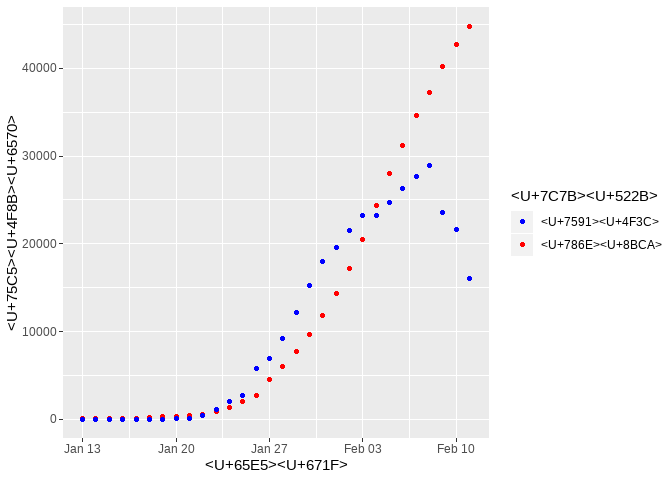
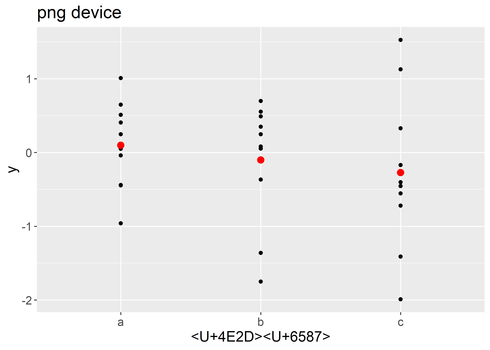

新冠状病毒报告
================
WY
2/4/2020

## 每日冠状病毒传染数据

数据来源是一个R数据包。. 可以用下面的命令安装该数据包

``` r
remotes::install_github("GuangchuangYu/nCov2019")
```

首先加载一些功能包和数据：

``` r
library(nCov2019)
library(tidyverse)
library(lubridate)
x <- get_nCov2019()
```

下面的命令用来整理数据：

``` r
dataDay <- x$chinaDayList %>% mutate(confirm = as.numeric(confirm), suspect = as.numeric(suspect), dead = as.numeric(dead), heal = as.numeric(heal), deathoverconfirm = dead/confirm)
dataDay <- dataDay %>% extract(date,c("month","day"), regex = "^(\\d+)\\.(\\d+)$",remove = FALSE) 
dataDay <- dataDay %>% mutate(month = as.numeric(month), day = as.numeric(day))
dataDay <- dataDay %>% mutate(date = make_date(2020,month,day))

dataAdd <- x$chinaDayAddList %>% mutate(confirm = as.numeric(confirm), suspect = as.numeric(suspect), dead = as.numeric(dead), heal = as.numeric(heal), deathoverconfirm = dead/confirm)
dataAdd <- dataAdd %>% extract(date,c("month","day"), regex = "^(\\d+)\\.(\\d+)$",remove = FALSE) 
dataAdd <- dataAdd %>% mutate(month = as.numeric(month), day = as.numeric(day))
dataAdd <- dataAdd %>% mutate(date = make_date(2020,month,day))
```

该数据的更新时间是（北京时间）：

``` r
x$lastUpdateTime
```

    ## [1] "2020-02-13 10:07:28"

确诊和疑似病例的数据如下：

``` r
dataDay %>% ggplot() + geom_point(aes(date,confirm,colour="确诊")) +geom_point(aes(date,suspect,color="疑似")) +theme(legend.position="right")+ylab("病例数")+xlab("日期")+labs(colour="类别")+scale_color_manual(values=c("blue","red"))
```

<!-- -->

<!-- -->

    ## Warning in grid.Call(C_stringMetric, as.graphicsAnnot(x$label)): font family not
    ## found in Windows font database
    
    ## Warning in grid.Call(C_stringMetric, as.graphicsAnnot(x$label)): font family not
    ## found in Windows font database
    
    ## Warning in grid.Call(C_stringMetric, as.graphicsAnnot(x$label)): font family not
    ## found in Windows font database

    ## Warning in grid.Call(C_textBounds, as.graphicsAnnot(x$label), x$x, x$y, : font
    ## family not found in Windows font database
    
    ## Warning in grid.Call(C_textBounds, as.graphicsAnnot(x$label), x$x, x$y, : font
    ## family not found in Windows font database
    
    ## Warning in grid.Call(C_textBounds, as.graphicsAnnot(x$label), x$x, x$y, : font
    ## family not found in Windows font database
    
    ## Warning in grid.Call(C_textBounds, as.graphicsAnnot(x$label), x$x, x$y, : font
    ## family not found in Windows font database
    
    ## Warning in grid.Call(C_textBounds, as.graphicsAnnot(x$label), x$x, x$y, : font
    ## family not found in Windows font database
    
    ## Warning in grid.Call(C_textBounds, as.graphicsAnnot(x$label), x$x, x$y, : font
    ## family not found in Windows font database
    
    ## Warning in grid.Call(C_textBounds, as.graphicsAnnot(x$label), x$x, x$y, : font
    ## family not found in Windows font database
    
    ## Warning in grid.Call(C_textBounds, as.graphicsAnnot(x$label), x$x, x$y, : font
    ## family not found in Windows font database
    
    ## Warning in grid.Call(C_textBounds, as.graphicsAnnot(x$label), x$x, x$y, : font
    ## family not found in Windows font database
    
    ## Warning in grid.Call(C_textBounds, as.graphicsAnnot(x$label), x$x, x$y, : font
    ## family not found in Windows font database

    ## Warning in grid.Call.graphics(C_text, as.graphicsAnnot(x$label), x$x, x$y, :
    ## font family not found in Windows font database

    ## Warning in grid.Call(C_textBounds, as.graphicsAnnot(x$label), x$x, x$y, : font
    ## family not found in Windows font database

<!-- -->
