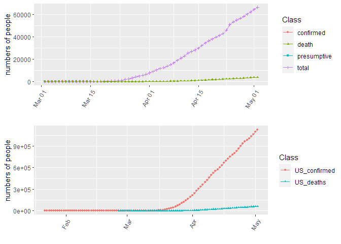
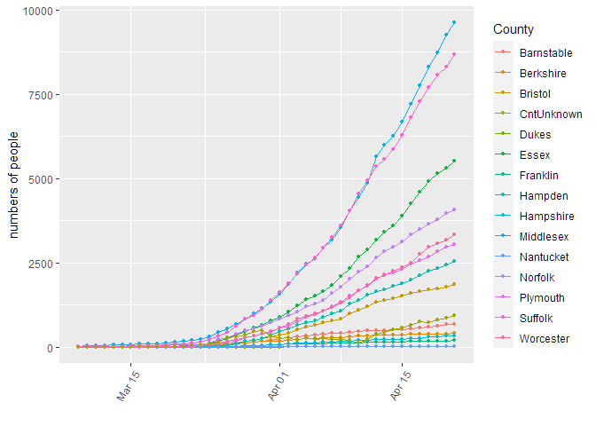
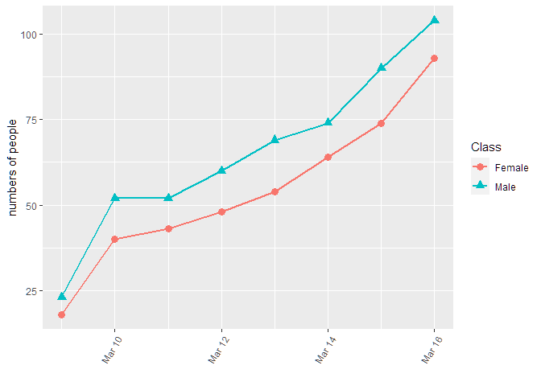
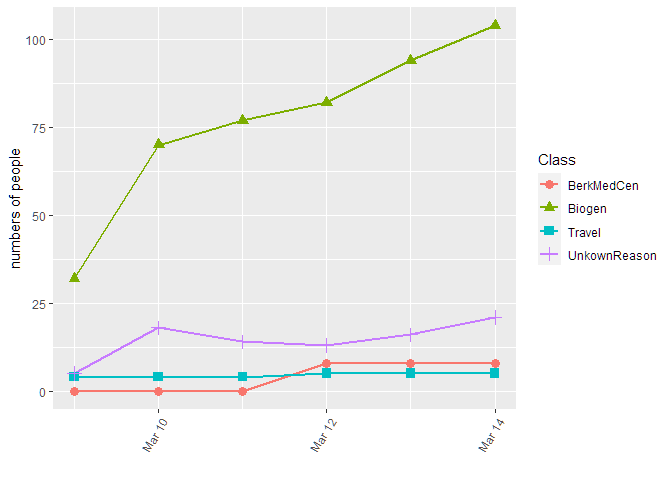
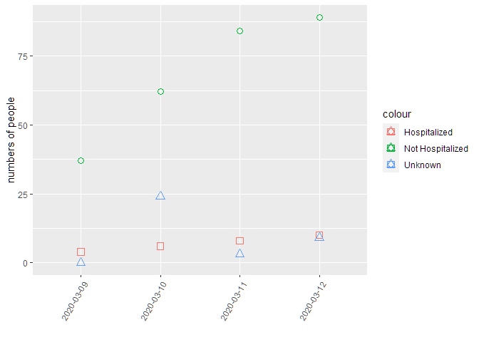

CoronaVirus in MASSACHUSETTS
================
WY
3/12/2020

The data was obtained from online sources

Here are the total number of confirmed cases and death in Massatuessas
and US:

Number of confirmed, suspected, total (confirmed+suspected) and death in
Massachusetts:

<!-- -->

The daily changes:

<!-- -->

Here’s some detailed information about the people who are diagnoised
positive. Here are the distribution by county:

<!-- -->

By gender:

<!-- -->

By how people were infected:

<!-- -->

Whether the patient is treated in hospital:

<!-- -->

By age:

<!-- -->
