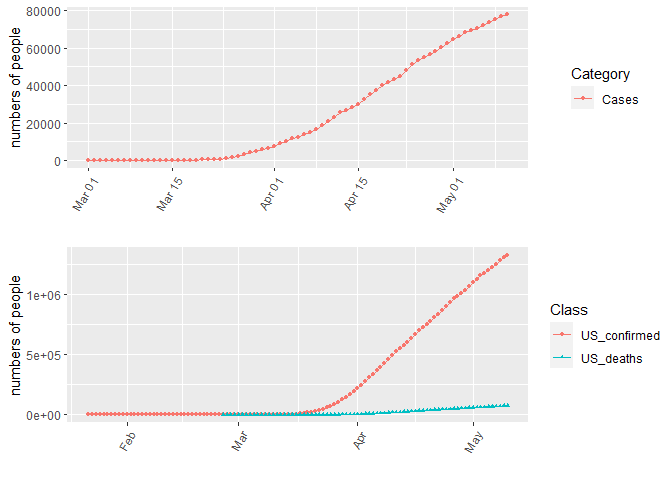

CoronaVirus in MASSACHUSETTS
================
WY
3/12/2020

The data was obtained from online sources

Here are the total number of confirmed cases and death in Massatuessas
and US:

Number of confirmed, suspected, total (confirmed+suspected) and death in
Massachusetts:

<!-- -->

The daily changes:

<!-- -->

Accumulated deaths related to Covid-19:

<!-- -->

Death per day:

<!-- -->

Data related to gender:

<!-- -->

Data related to age, where the percentage is calculated among people who
are/were infected by Covid-19:

<!-- --><!-- --><!-- -->

Data by County:

<!-- --><!-- --><!-- -->
